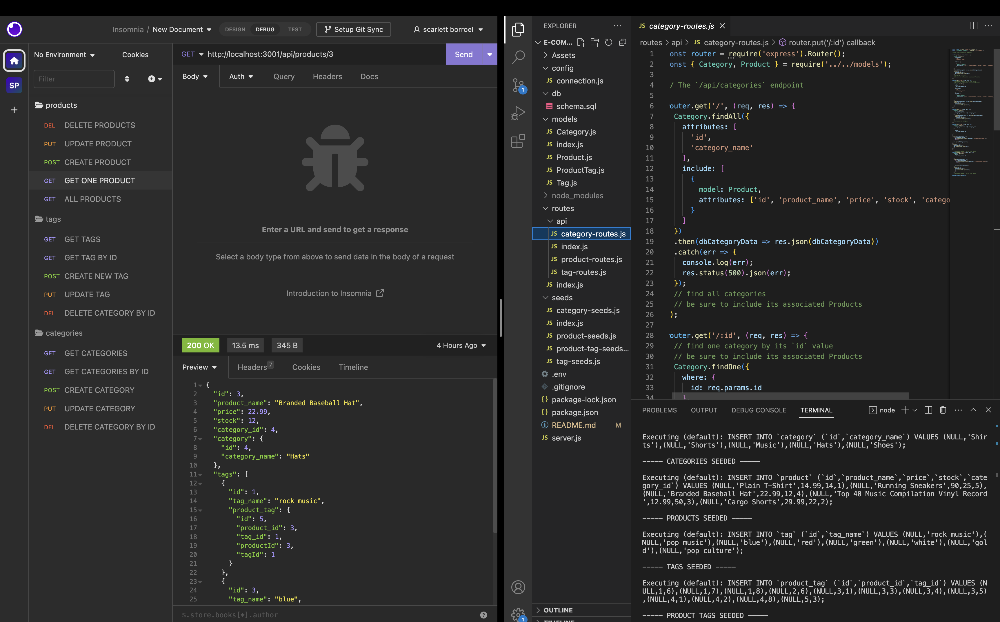

# e-com-ondemand

## Description 
The motivation behind this project was to build the back end for an e-commerce site by modifying the starter codes that were given.This was accomplished by working with Express.js API to use Sequelize to interact with the MySQL database and connect the user to the e-com site.
[DEMO](https://drive.google.com/file/d/1QwrNZEdwhsKfKMeSulJMsVh6USzXGzLA/view)

## Installation
In order to install you would do the folllwoing:
1. npm init
2. npm install express
3. npm install mysql2
4. npm install express

## Usage
Run this command at the root of the code. Run 'npm run seed' and then 'npm node server.js' or npm start.

## License 
N/A
